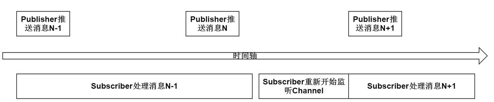
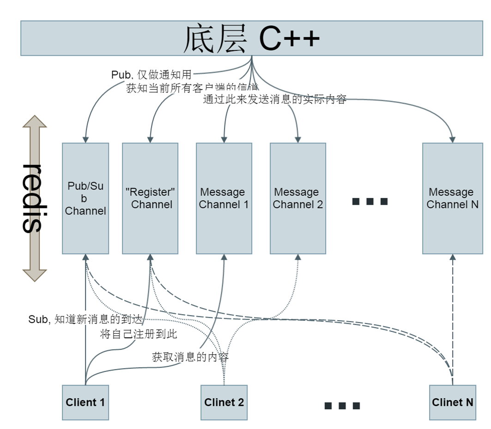

美团面试——拙劣的演技
======================

.. author:: default
.. categories:: 生活
.. tags:: 生活、求职
.. comments::

周三去美团面试，自我评价演技拙劣。不多述，只谈谈做的最差的几点，吸取教训。

我做了什么
----------

在360的这大半年，我做了些什么？这件事说不清楚，是最不应该也是差劲的地方。

天巡的可视化
+++++++++++++

首先说 `天巡 <http://tianxun.360.cn/>`_ 。天巡是一套针对企业无线应用环境推出的安全威胁发现与防御系统。
直白的说就是监测某个范围内的无线环境，自动发现并防御无线攻击，允许对范围内的热点进行阻断等操作。

天巡的可视化项目通过与北大可视化实验室的合作来探索天巡可视化的方向与具体方法。
项目的第一版主要通过天巡底层抓取的无线信息来实时展示会场人流的移动、聚散情况和无线攻击事件，
在 `ISC 2015 <http://isc.360.cn/2015/index.html>`_ 与 `CNCC 2015 <http://cncc.ccf.org.cn/>`_ 上均有展示。

项目由北大可视化实验室负责提供前端方案与实现。
我通过 **Django** 来实现服务端接口，通过 **redis** 、 **websocket** 来实现消息的实时、主动推送。

难点
~~~~

项目中遇到的难点主要是如何将底层抓取的数据实时推送到前端，我选择的方案是这样的。
底层（ **C++** ）通过 **redis** 将信息推送到中间层（ **Python** ），
**Python** 再通过 **websocket** 与前端建立长连接，进而实现消息的实时、主动推送。
消息从底层到中间层的难度要高于从中间层到前端，因为从中间层到前端这一步，
我可以在 `django-websocket-redis <https://github.com/jrief/django-websocket-redis>`_ 的基础上实现。
而消息从底层传递到中间层的过程，如果直接（仅）使用redis提供的Pub/Sub机制可能导致数据的丢失，所以我使用了一个修改过的设计方案。

先说Pub/Sub导致的数据丢失问题。

首先需要说一句的是：redis的Pub/Sub机制是一个好东西，党国需要夸奖它一下。
Publisher（发布者）将消息推送到特定的channel。同时Subscriber（订阅者）在另一端选择监听自己关注的一个或多个channel。
这样就实现了一套非常灵活的消息传递（广播）机制。

我一开始的错误在于，试图 **仅** 通过这套机制来传递大量的数据。
需要明白，当Publisher向channel推送新消息时，会将channel中的旧消息删除。
所以当Publisher推送消息的频率太快，而subscriber却有事耽搁了时，subscriber就可能会遗漏一些信息。
下图描述情况中，Subscriber就遗漏了消息N。

在ISC 2015（3天20000人）这样的会议上，天巡向一个客户端每分钟需要推送的数据在1200条左右。
消息从底层推送到中间层（通过上述的Pub/Sub机制）后，中间层还需要花时间做一些额外工作，所以消息丢失的情况是很有可能出现的。

幸运的是我在中秋节那天就发现了这个问题。

于是改改改，数据会丢，那就让他不丢。
思路是让Publisher只能在channel中加入新消息，而消息的删除只能由Subscriber在读取后操作。
具体的：

    - 通过redis的list来存储实际的消息内容，Publiher只进行push操作，Subscriber只进行pop操作
    - Publisher通过redis的Pub/Sub机制通知Subscriber新消息的到达
    - Publisher通过一个额外的channel，可以知道当前所有Subscriber的对应的消息channel。

这样，我们把消息的通知和实际内容分离。而因为新消息产生的速度非常快，
所以即使某个通知丢失了，导致的结果也不过是中间层收到消息的时间比实际实际稍微晚上一点点。

具体的做法是这样的：

1. 当一个websocket连接建立时，需要做三件事：

   - 分配一个Message Channel给这个连接
   - 注册这个Message Channel到Register Channel
   - 做为一个Subscriber监听Pub/Sub Channel

2. 底层的C++代码，也需要做三件事：

   - 当新消息产生时，通过Register Channel得知全部的Message Channel
   - 随后向每个Message Channel写入消息内容
   - 最后，做为Publihser，通过Pub/Sub Channel来通知所有Subscriber

3. 在一个websocket链接断开时，需要将对应的Message Channel从Register Channel中删除，
   以免底层需要写入消息的Message Channel数量失控。

MySQLdb的小坑
~~~~~~~~~~~~~

赖美女老师的福，大学期间数据库相关的内容学的还是蛮不错的。可惜工作没多久，锁粒度，隔离级别，事务之类的东西就都忘记了。
再加上Python的MySQLdb模块，默认每次SELECT操作后不会自动commit，导致自己在这次项目中踩了一个小坑。
具体的内容，在我的第一遍 `博文 </2015/10/23/python_mysql_commit.html>`_ 中已经介绍的比较详细了，
这儿就不多做叙述了。

一个网站
++++++++

一个网站，没有什么奇奇怪怪的东西，很平常的一个网站。
实现的动能主要是：

    - 扫描用户上传的IOS应用，返回基本的安全报告。
    - 抓取国内外与苹果产品有关的咨询，并集中展示

项目中遇到的一个坑与Django、MySQL有关。
事情是这个样子的，项目开发期间使用的是服务器上的数据库，项目完成时，
有一部分数据需要迁移至公司的HULK平台上，统一管理。
迁移后，大量Django Model的save方法报错，具体的错误为：

.. code-block:: python

    IntegrityError: (1062, "Duplicate entry '***' for key 'PRIMARY'")

一番折腾之后，揣测应该是Django“错误”的把update操作当成insert来处理了，
这两种方法的在Django中对应的都是save。
查看Django中相关代码，很容易理清save的逻辑：
Django的save方法，先执行一次update操作，随后根据update返回的内容决定是否在进行insert操作。
而我们的代码之所以会错误，
就是因为“根据update返回的内容”进行判断这一步，Django做出了错误的判断。

为什么会错的呢？我们先来看一次update操作会返回哪些内容。

.. code-block:: mysql

    mysql> update client_action set hotspot_id = 1 where id = 1001;
    Query OK, 0 rows affected (0.00 sec)
    Rows matched: 1  Changed: 0  Warnings: 0

返回的关键信息有两个：

    - changed，指实际受影响的行数
    - rows matched，指匹配的行数

使用MySQLdb连接数据库是，你可以通过rowscount来获取changed。

.. code-block:: python

    >>> conn = MySQLdb.connect(host='host', user='user', passwd='passwd', db='db')
    >>> cur = conn.cursor()
    >>> cur.execute('update client_action set hotspot_id = 1 where id = 1001;')
    0L
    >>> cur.rowcount
    0L

而如果想知道rows matched，你就需要在建立连接时指定标识FOUND_ROWS，
此时rowscount就是rows matched的值。

.. code-block:: python

    >>> conn = MySQLdb.connect(
    ...     host='host', user='user', passwd='passwd', db='db',
    ...     client_flag=MySQLdb.constants.CLIENT.FOUND_ROWS
    ... )
    >>> cur=conn.cursor()
    >>> cur.execute('update client_action set hotspot_id = 1 where id = 1001;')
    1L
    >>> cur.rowcount
    1L

Django通过设置FOUND_ROWS来使update操作返回rows matched，当rows matched大于0，
Django就认为此次save仅仅是更新数据，于是不执行insert操作。
而报错的原因是：当从数据库中取出一条数据，在原封不动的保存回去时，
Django会错误的认为需要执行insert操作。这个错误可能出现在三个地方：

    - Django的相关代码错了
    - MySQLdb的相关代码错了
    - 公司的HULK平台错了

为此，我做了一个小实验。

.. code-block:: python

    >>> conn = MySQLdb.connect(
    ...     host='10.142.228.31',
    ...     port=13003,
    ...     user='ios_audit',
    ...     passwd='1c0426eb2c0ca398',
    ...     db='ios_audit',
    ...     client_flag=MySQLdb.constants.CLIENT.FOUND_ROWS
    ... )
    >>> cur = conn.cursor()
    >>> cur.execute("update application set id=24 where id=24")
    >>> print cur._info
    Rows matched: 1  Changed: 0  Warnings: 0
    >>> print cur.rowcount
    0
    >>> cur.close()
    >>> conn.close()

很显然，当连接的数据库为HULK时，FOUND_ROWS这个flag并没有起效果。
至此，已经可以排除Django出错这个选项了。
随后我试图去MySQLdb寻找FOUND_ROWS是怎么被处理的。可惜在MySQLdb的Python部分并没有找到对应的代码。

换个思路，HULK上的MySQL的版本是5.0，开发中使用的是5.6，会不会是低版本的MySQL不支持这个flag呢？
然而我在 `<https://dev.mysql.com/doc/refman/5.0/en/mysql-real-connect.html>`_ 中找到了FOUND_ROWS这个flag，
说明不是版本的问题。

TODO吧，有机会问问是不是HULK的问题吧。

问题的原因没找到，但是问题还是得要解决。方法有点野路子，不想回到业务代码里面一处一处改，
所以我覆写了model的save方法，自己判断是update还是insert，然后通过force_update来强制指定Django仅执行update。
之所以说是一个野路子是因为判断是否是update的方法很不健壮。

.. code-block:: python

    def save(self, *args, **kwargs):
        try:
            self.last_modified = timezone.now()
            if getattr(self, 'id', None) is not None:
                kwargs['force_update'] = True
            super(Application, self).save(*args, **kwargs)
        except DatabaseError as e:
            if 'Forced update did not affect any rows.' in str(e):
                pass
            else:
                raise e

面试的技巧
----------

大抵是在公司呆久了，很多应该主动的时候，都会很“懒”。

做点准备
++++++++

| 下次面试的时候别再不太清楚最近做了什么了！
| 我主要用的第三方库：

    - Django

        + django-debug-toolbar
        + django-websocket-redis
        + django-crontab
        + django-ipware
    - requests
    - scrapy
        + scrapy-djangoitem
    - numpy, scipy
    - sphinx, tinker

推销你的长处
++++++++++++

每个人都有自己的长处，应该向面试官安利下，不能被动的等人家问到。也许人家问不到。

规避你的短处
++++++++++++

我的两个短处：

    - 不爱死记

      但是能推，当再被问道merge sort最好/最坏情况的复杂度的时候，
      可以要求“给我5min，我写一次，再回答你”

    - 水平不够

      当再被问到，可以谈谈Linux的命令的时候，可以回到“你提个需求，我来实现”。

字写好点
++++++++

真的，不骗你！不要在用纯白纸了。

.. 天巡_: http://tianxun.360.cn/
