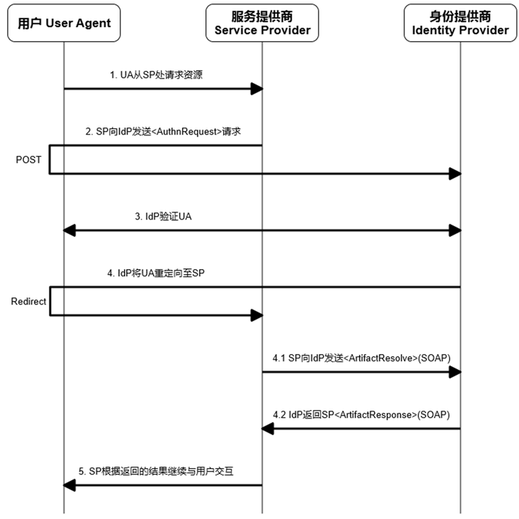
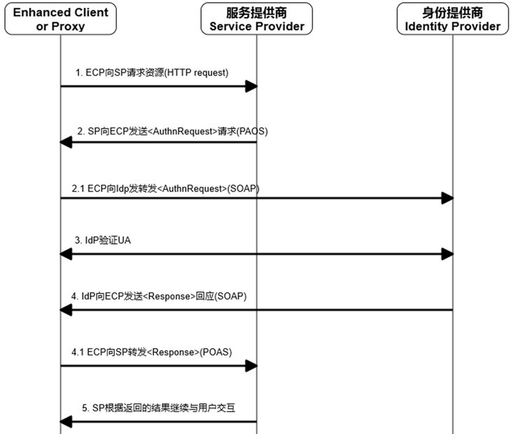
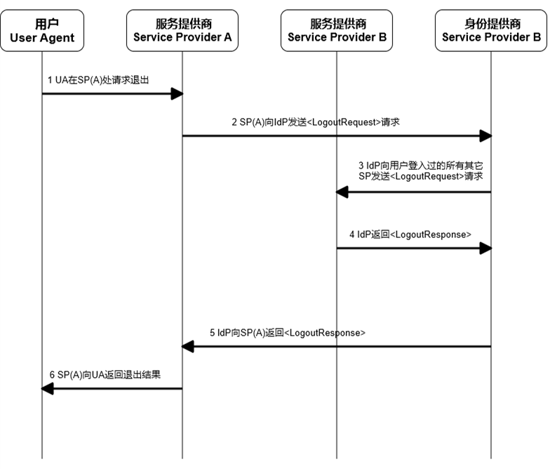

基于SAML的单点登录系统一
========================

.. author:: default
.. categories:: 技术
.. tags:: SAML, SSO
.. comments::

前言
----
最近工作中在搭建一个基于SAML的单点登录（Single sign-on）系统，准备把相关的知识总结与此。
由于周围没有有经验的大腿可以抱，所以所有的内容都是我从 Mr.Google 和一些标准文档中整理过来的。
错漏应该是存在的，如果有人愿意提醒，感激不尽。

基本概念
--------

SSO
+++

单点登录，single sign-on，习惯简称为 SSO，是一种针对 **多个相关但独立的系统** 的用户登录和授权的方式。
在 SSO 中，用用户可以通过一套用户名和密码登录多个系统，更进一步，可以无缝登录多个系统。
这儿的无缝登录指的是：当用户在某个系统登录后，其再去访问其它系统中的受限资源时，就不需要在登录，
即通过一次登录，登录了多个系统。

从上面的描述中，我们可以看出 SSO 主要有以下特点：

    - SSO 主要用于有多个相关但独立的系统的情况
    - 对用户而言，SSO 的优点在于：

      + 只需要记录一套账号密码就可以登录多个系统
      + 只需要一次登录就可以登录多个系统

      OAuth 等登录方式也可以实现第一点，所以 SSO 的主要优势在于 **一次登录多个系统** 。
    - SSO 的缺点也很明显：

      + 用户登录一次就对所有资源都有了访问权限，那么用户的权限被误用、盗用的可能性自然也就高了
      + SSO 对稳定性的要求会更高，因为受影响的系统更多

SAML
++++

Web 中一般通过浏览器的 cookies 来维护用户的登录状态，但是 cookies 并不能在不同的域名之间传递。
SSO 需要在多个系统（多个域名）之间共享用户的状态，所以就需要一种机制，在不同的系统之间共享用户的状态。
Security Assertion Markup Language，SAML，就是一种基于XML的标准去在不同的系统之间传递用户的验证、属性和授权信息。

信息交换流
----------

在 SSO 中，基本的角色有三种：

    - 用户，User Agent, UA，通过浏览器或其它应用来使用 SP 提供的服务。
    - 服务提供商，Service Provider，SP，提供具体服务的系统，比如公司内的人力资源网站、考勤网站等。
    - 身份提供商，Identity Provider, IdP，负责验证用户、提供基本的用户信息和对用户授权。

登录
++++

以用户通过浏览器来访问服务提供商的服务为例，用户首次登录的流程如下：

.. image:: login_01.png
    :scale: 80
    :align: center
    :alt: 通过浏览器首次登录流程图
    :name: login_basic

其中：

    1. 未登录的 *用户* 访问 *服务提供商* 的某些受限资源。 
    2. *服务提供商* 向 *身份提供商* 发送一个 ``<AuthnRequest>`` 的 SAML 请求。
    3. *身份提供商* 验证 *用户* 的身份。
    4. *省份提供商* 向 *服务提供商* 返回一个 ``<Response>`` 的 SAML 回应。
    5. *身份提供商* 根据返回的信息，决定和 *用户* 的后续交互。

在 OASIS_ 提供的一系列文档中，根据用户首先访问的是服务提供商还是身份提供商将 SSO 分为
*SP_Initiated SSO* 和 *IdP_Initiated SSO* ；根据用户使用的浏览器还是其他客户端将 SSO 分为
*Web Browser SSO* 和 *Enhanced Client and Proxy SSO* 。

Bindings
++++++++

在了解这些具体的之前，我们有必要了解 SAML 中如何通过现有的通信协议来交换请求和回应。
在 SAML 中我们称之为 **Binding** 。

    - **HTTP Redirect Binding**

      在这种情况中，发送 SAML 请求的一方和接收的一方需要通过一个
      `HTTP user agent <https://www.ietf.org/rfc/rfc2616.txt>`_ 来中转 SAML 消息。
      使用 HTTP user agent 中转的原因可能是通过 SAML 交流的双方无法直接通信，
      不过更多的时候是因为是需要 HTTP user agent 来补充需要的信息，比如说
      需要用户来输入账号、密码来完成用户的验证。

      SAML 请求方通过发送一个 status 为 303 或 302 的 HTTP response 给 HTTP user agent
      来实现中转。
    - **HTTP POST Binding**

      在这种情况下，仍然需要 HTTP user agent 来中转 SAML 消息。不同的地方在于，
      此时 SAML 请求方发送给 HTTP user agent 一个 XHTML 文件，其中包含了一个表单，
      用来存储具体 SAML 信息，通过某些方法（比如说一段JavaScript）可以让 HTTP user agent 自动提交表单。

    - **SOAP Binding**

      Simple Object Access Protocol，SOAP，是一种在不同的系统之间交换结构化信息的标准。
      SAML 的请求方和接收方通过零个或多个 SOAP 中介来进行直接的信息交换。
    - **Reverse SOAP(PAOS) Binding**

      PAOS 中涉及两个角色

        + HTTP requester，同时也是 SAML responser
        + SAML requester，同时也是 HTTP responser

      四类消息：

        + 单纯的 HTTP request
        + 单纯的 HTTP response
        + HTTP request 的内容是 SOAP，而 SOAP 表达的是 SAML response，
          简称 HTTP request(SOAP(SAML response))
        + HTTP response 的内容是 SOAP，而 SOAP 表达的是 SOAP request，
          简称 HTTP response(SOAP(SAML request))

       PASO 被使用的情况主要是：
       客户端发送了一个请求，但是服务端需要再从客户端除获取一些信息之后才能给出答复。

    - **HTTP Artifact Binding**

      描述了这样一种情况，需要 HTTP user agent 来补充一些信息，但是一些重要的信息不希望通过
      HTTP user agent 来传递，而是希望在发送方和接收方之间直接传递。

      于是，即使用 HTTP Redirect Binding 或 HTTP POST Binding，也使用 SOAP Binding 或 PAOS Binding。

现在再来看用户通过浏览器首次登录的流程。
其实可以细分为两种情况：

    - **SP_Initiated SSO: Redirect/POST Bindings**

      即在第 2 步中转 ``<AuthnReqeust>`` 时使用 HTTP Redirect Binding，
      而在第 4 步中转 ``<Response>`` 时使用 HTTP POST Binding。
    - **SP_Initiated SSO: POST/Artifact Bindings**

      在这种情况中，通过 HTTP POST Binding 来发送 ``<AuthnRequest>`` ，
      主要是考虑到 HTTP Redirect Binding 通过 URL 来传递参数，当参数长度较长时，
      可能遇到一些问题。
      而在第 4 步时，通过 HTTP Artifact Binding 来传达具体的 SAML 信息。
      于是最终的流程变更为：

当用户通过 Enchaned Client or Proxy 来访问服务是，首次登录流程再次变更。
区别在于用户和服务提供商通过 HTTP PAOS Binding 来交流，
用户和身份提供商通过 HTTP SOAP Binding 来交换信息，
具体如下：

我们上面讲述的都是用户首先访问服务提供商，进而导致登录的情况。
也有一种情况是，用户首先访问身份提供商，登录成功后，再选择某个服务提供商进行访问。
因为这种情况比较小众而且没有本质的区别，就不在这儿多做叙述。

退出
----

退出的情况比较简单，需要注意是：当用户在某个服务提供商处请求退出后，身份提供商应该负责通知
其他用户访问过的服务提供商销毁对应 session。
具体的流程：

.. _OASIS: https://www.oasis-open.org/committees/tc_home.php?wg_abbrev=security
