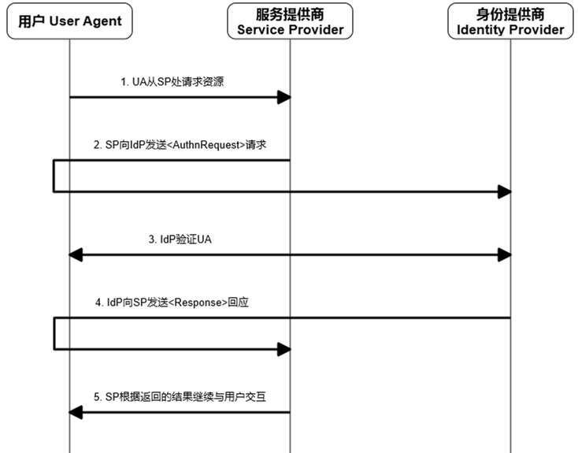

基于SAML的单点登录系统 一
=========================

.. author:: default
.. categories:: 技术
.. tags:: SAML, SSO
.. comments::

前言
----

最近忙于搭建一个基于SAML的单点登录（Single sign-on）系统，准备把相关的知识总结与此。
由于周围没有有经验的大腿可以抱，一切的内容都需要我从 Mr.Google 和一些标准文档中整理过来。
所以错漏可能难以避免，如果愿意提醒一二，感激不尽。

基本概念
--------

SSO
+++

单点登录，single sign-on，习惯简称为 SSO，是一种针对 **多个相关但独立系统** 的用户登录和授权的方式。
在 SSO 中，用户可以通过一套用户名和密码登录多个系统，更进一步的，可以在多个系统间实现无缝登录。
这儿的无缝登录指：当用户在某个系统登录后，再去访问其它系统时，就不需要再登录，
即通过一次登录，登录了多个系统。

从上面的描述中，我们可以看出 SSO 主要有以下特点：

    - SSO 主要用于有多个 **相关但独立** 的系统
    - 对用户而言，SSO 的优点在于：

      + 只需要记录一套账号密码就可以登录多个系统
      + 只需要一次登录就可以登录多个系统

      OAuth 等登录方式也可以实现第一点，所以 SSO 的主要优势在于 **一次登录多个系统** 。
    - SSO 的缺点也很明显：

      + 用户登录一次就对所有系统都有了访问权限，那么用户的权限被误用、盗用的可能性也就更高
      + 对 SSO 系统稳定性的要求会更高，因为受影响的系统更多

SAML
++++

Web 中一般通过浏览器的 cookies 来维护用户的登录状态，但是 cookies 并不能在不同的域名之间传递。
而 SSO 需要在多个系统（多个域名）之间共享用户的状态，
所以就需要一种机制，在不同的系统之间共享用户的状态。
Security Assertion Markup Language，SAML，
是一种基于XML的标准，长于在不同的系统之间传递用户的验证、属性和授权信息。

登录流程
--------

在 SSO 中，基本的角色有三种：

    - 用户，User Agent, UA，通过浏览器或其它应用来使用服务提供商提供的服务。
    - 服务提供商，Service Provider，SP，提供具体服务的系统，比如公司内的人力资源网站。
    - 身份提供商，Identity Provider, IdP，负责验证用户、提供基本的信息和对用户授权。

以用户通过浏览器来访问服务提供商的服务为例，用户首次登录的流程如下：

其中每个步骤的含义如下：

    1. 未登录的 *用户* 访问 *服务提供商* 的某些受限资源。 
    2. *服务提供商* 向 *身份提供商* 发送一个 ``<AuthnRequest>`` 的 SAML 请求。
    3. *身份提供商* 验证 *用户* 的身份。
    4. *身份提供商* 向 *服务提供商* 返回一个 ``<Response>`` 的 SAML 响应。
    5. *身份提供商* 根据返回的信息，决定和 *用户* 的后续交互。

在 OASIS_ 提供的一系列文档中，根据用户首先访问的是服务提供商还是身份提供商、
用户使用的是浏览器还是其他客户端这两个标准对流程做了细分。

Bindings
++++++++

在了解这些具体的分类之前，我们有必要了解 SAML 是如何通过现有的通信协议来交换请求和响应。
相关内容在 SAML 中被称为 **Binding** 。

    - **HTTP Redirect Binding**

      在这种情况中，发送 SAML 请求的一方和接收的一方需要通过一个
      `HTTP user agent <https://www.ietf.org/rfc/rfc2616.txt>`_ 来中转 SAML 消息。
      使用 HTTP user agent 中转的原因可能是通过 SAML 交流的双方无法直接通信，
      不过更多的时候是因为是需要 HTTP user agent 来补充需要的信息，比如说
      需要用户来输入账号、密码来完成用户的验证。

      SAML 请求方通过发送一个 status 为 303 或 302 的 HTTP response 给 HTTP user agent
      来实现中转。

    - **HTTP POST Binding**

      在这种情况下，仍然需要 HTTP user agent 来中转 SAML 消息。不同的地方在于，
      此时 SAML 请求方发送给 HTTP user agent 一个 XHTML 文件，其中包含了一个表单，
      用来存储具体 SAML 信息，通过某些方法（比如说一段JavaScript）可以让 HTTP user agent 自动提交表单。

    - **SOAP Binding**

      Simple Object Access Protocol，SOAP，是一种在不同的系统之间交换结构化信息的标准。
      SAML 的请求方和接收方通过零个或多个 SOAP 中介来进行直接的信息交换。
      一般通过HTTP来传送 SOAP信息。

    - **Reverse SOAP(PAOS) Binding**

      PAOS 有点复杂，所以需要稍微多说几句。
      PAOS 中涉及两个角色：

        + HTTP requester，同时也是 SAML responder
        + SAML requester，同时也是 HTTP responder

      四类消息：

        + 单纯的 HTTP request
        + 单纯的 HTTP response
        + HTTP request 的内容是 SOAP，而 SOAP 表达的是 SAML response，
          简称 HTTP request(SOAP(SAML response))
        + HTTP response 的内容是 SOAP，而 SOAP 表达的是 SOAP request，
          简称 HTTP response(SOAP(SAML request))

       PASO 被使用的情况主要是：
       客户端发送了一个请求，但是服务端需要再从客户端除获取一些信息之后才能给出答复。

       具体的流程是：

        1. HTTP requester 向 SMAL requester 发送一个 HTTP request
        2. SMAL requester 向 HTTP requester 返回一个 HTTP response(SOAP(SAML request))
        3. HTTP requester 向 SMAL requester 发送一个 HTTP request(SOAP(SAML request))
        4. SMAL requester 向 HTTP requester 返回一个 HTTP response，作为对最开始的请求的响应

    - **HTTP Artifact Binding**

      描述了这样一种情况，需要 HTTP user agent 来补充一些信息，
      但是其它的信息在发送方和接收方之间直接传递。

      于是，即使用 HTTP Redirect Binding 或 HTTP POST Binding，也使用 SOAP Binding 或 PAOS Binding。

Web Browse
++++++++++

现在再来看用户通过浏览器首次登录的流程。
其实可以细分为两种情况：

    - **SP_Initiated SSO: Redirect/POST Bindings**

      流程和图 login_basic_ 中的一致，具体的：

        - 在第 2 步中转 ``<AuthnReqeust>`` 时使用 HTTP Redirect Binding，
        - 而在第 4 步中转 ``<Response>`` 时使用 HTTP POST Binding。
    - **SP_Initiated SSO: POST/Artifact Bindings**

      在这种情况中，通过 HTTP POST Binding 来发送 ``<AuthnRequest>`` ，
      主要是考虑到 HTTP Redirect Binding 通过 URL 来传递参数，当参数长度较长时，
      可能遇到一些问题。

      而在第 4 步时，通过 HTTP Artifact Binding 来传达具体的 SAML 信息。
      于是最终的流程变更为：

.. image:: login_02.png
    :scale: 80
    :align: center

Enchaned Client or Proxy
++++++++++++++++++++++++

当用户通过 Enchaned Client or Proxy 来访问服务时，首次登录流程再次变更。
区别浏览器的地方在于：

    - 用户和服务提供商通过 HTTP PAOS Binding 来交换信息
    - 用户和身份提供商通过 HTTP SOAP Binding 来交换信息

具体如下：

.. image:: login_03.png
    :scale: 80
    :align: center

我们上面讲述的都是用户首先访问服务提供商，进而导致登录的情况。
也有一种情况是，用户首先访问身份提供商，登录成功后，再选择某个服务提供商进行访问。
因为这种情况比较小众而且没有本质的区别，就不在这儿多做叙述。

退出流程
--------

退出的情况比较简单，需要注意是：当用户在某个服务提供商处请求退出后，身份提供商应该负责通知
其他用户访问过的服务提供商销毁对应 session。
具体的流程：

.. image:: logout.png
    :scale: 80
    :align: center

参考
----

#. `Single sign-on - Wikipedia, the free encyclopedia
   <https://en.wikipedia.org/wiki/Single_sign-on>`_
#. `Security Assertion Markup Language (SAML) V2.0 Technical Overview
   <https://www.oasis-open.org/committees/download.php/27819/sstc-saml-tech-overview-2.0-cd-02.pdf>`_
#. `Bindings for the OASIS Security Assertion Markup Language (SAML) V2.0
   <http://docs.oasis-open.org/security/saml/v2.0/saml-bindings-2.0-os.pdf>`_
#. `Profiles for the OASIS Security Assertion Markup Language (SAML) V2.0
   <http://docs.oasis-open.org/security/saml/v2.0/saml-profiles-2.0-os.pdf>`_

.. _OASIS: https://www.oasis-open.org/committees/tc_home.php?wg_abbrev=security

